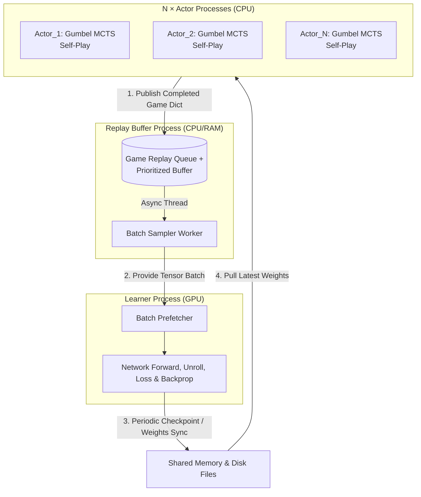

# 三人八子棋 (Trifeet v2) - MuZero 强化学习系统

本项目是一个基于 **MuZero** 和 **Gumbel MCTS** 的三人八子棋（Eight-in-a-Row）人工智能训练与对弈系统。系统集成了 **DeepSeek MLA** 骨干网络、**EfficientZero** 隐状态一致性、**Engram** 外部情节记忆等先进特性，并支持课程学习（Curriculum Learning）、基于种群的训练（PBT）和自我对弈联赛（Self-Play League）。

本文档将系统性地阐述各模块的详尽数学原理、核心超参数设定及其物理意义，并提供程序执行的图形化框图与详细描述。

---

## 目录

1. [模块详尽数学与算法原理](#1-模块详尽数学与算法原理)
   - 1.1 状态、动作与价值抽象
   - 1.2 高阶网络架构设计 (DeepSeek MLA / Engram / EfficientZero)
   - 1.3 Gumbel MuZero MCTS 搜索逻辑
   - 1.4 多重损失函数构建
2. [核心配置参数及其意义](#2-核心配置参数及其意义)
   - 2.1 游戏与网络参数
   - 2.2 搜索与探索参数
   - 2.3 训练与异步并发控制
3. [程序执行框图与详尽描述](#3-程序执行框图与详尽描述)
   - 3.1 异步训练系统宏观架构 (train_async)
   - 3.2 自我对弈数据流 (Actor Loop)
   - 3.3 Learner 参数更新与展开 (Unroll) 流程
4. [高级演化模块说明](#4-高级演化模块说明)
5. [操作与使用指南](#5-操作与使用指南)

---

## 1. 模块详尽数学与算法原理

### 1.1 状态、动作与价值抽象

三人博弈环境具备显著的非对称性和局部视野特性。框架使用如下数学抽象：

- **观测状态 (Observation)**: 输入网络的是以当前落子预测点为中心的局部视野（`21×21`）加上全局棋盘的缩略图（共 8 通道）。所有观测严格按 **当前玩家视角** 构建，消除网络对绝对玩家编号的依赖。
- **动作空间 (Action Space)**: 动作空间被映射为局部视野内的离散格点，大小为 `policy_size = 21 × 21 = 441`。网络只输出在当前关注区域内的先验概率（Prior）。
- **价值体系 (Value Semantics)**:
  - 价值 $V$ 表示为三维向量 $(V_{\text{me}}, V_{\text{next}}, V_{\text{prev}})$，分别代表当前玩家、下一顺位玩家、上一顺位玩家在当前状态下的期望折扣回报（Discounted Return）。
  - 返回的即时奖励 $r$ 是标量（仅当前玩家获奖）。
  - 终端目标由名次决定，例如第一名 $1.0$，第二名 $-0.2$，第三名 $-1.0$。所有训练过程中的 N步时序差分（n-step TD）均在此三维向量上进行递推与 Bootstrap 旋转预测。

### 1.2 高阶网络架构设计

核心网络 (`MuZeroNetwork`) 在经典的表示（Representation）、动力学（Dynamics）、预测（Prediction）三大结构上叠加了现代模块：

1. **DeepSeek MLA Transformer 骨干**:
   - 取代传统 ResNet，使用 Multi-Head Latent Attention（多头潜在注意力）处理空间图谱特征，大幅提升在大尺度棋盘（如 100x100）下跨远距离子力的感知与推理能力。
2. **Engram 发作式记忆 (Episodic Memory)**:
   - $h^{\text{aug}} = \text{CrossAttention}(h, K_{\text{engram}}, V_{\text{engram}})$。通过关联历史博弈数据特征，动态增强隐状态 $h$，使模型具备类似“死活棋词典”的记忆检索能力。
3. **EfficientZero 一致性 (Consistency) 与 Focus**:
   - **Consistency**: 引入 SimSiam 式自监督：预测的下一帧隐状态与实际下个真实观察编码后的隐状态，计算余弦相似度：$\mathcal{L}_{\text{cons}} = 2 - 2\cos\langle \text{proj}(h_{t+1}), \text{proj}(\text{repr}(o_{t+1})) \rangle$。
   - **Focus Head**: 辅助网络，输入全局缩略图，预测该落子回合应该将“视口中心”放在棋盘的哪里（归一化坐标），用 MSE 损失训练。

### 1.3 Gumbel MuZero MCTS 搜索逻辑

区别于标准 PUCT，为了在根节点强化探索并在小模拟数下获得高质量行动，采用了 **Gumbel MuZero** 算法结合 **Sequential Halving（连续折半）** 搜索：

1. **根节点探索设定**:
   - 对于网络输出的先验 logits $\pi_{\text{prior}}$，叠加热度衰减的 Gumbel 分布噪声：$\text{logits}^* = \pi_{\text{prior}} + \text{Gumbel}(0, 1)$。
2. **Sequential Halving**:
   - 选取 Top-$m$ （例如 16）个动作作为初始根分枝候选。
   - 每经过一轮深度遍历（批量化 `_batch_simulate_phase` 评价叶节点），淘汰一半动作（Halving），最终收敛到唯一的最优探索路径。
3. **策略提升 (Policy Improvement)**:
   - 根据搜索树中累计完成的评估 Q 值（经 MinMax 规范化），生成比网络先验更强的软策略（目标策略）：
   - $\pi_{\text{target}} = \text{softmax}(\logits^* + c_{\text{scale}} \cdot Q_{\text{normalized}})$。该动作分布用作网络策略头的反向传播的交叉熵标签。

### 1.4 多重损失函数构建

Learner 在进行 $K$ 步展开（Unroll）后，计算并加和各时刻 $k$ 的损失，且除以 $K$ 以保证梯度平稳：

$$ \mathcal{L} = \frac{1}{K} \sum_{k=0}^{K} \Big[ \underbrace{\lambda_v \| \mathbf{V}_k - \mathbf{z}_k \|^2}_{\text{Value (MSE)}} + \underbrace{\lambda_r ( r_k - u_k )^2}_{\text{Reward (MSE)}} - \underbrace{\lambda_\pi \boldsymbol{\pi}_k^{\text{MCTS}} \cdot \log \mathbf{p}_k}_{\text{Policy (CE)}} + \underbrace{\lambda_c (2 - 2\cos(\hat{h}_k, h_k))}_{\text{Consistency}} \Big] + \mathcal{L}_{\text{focus}} $$

其中 $\mathbf{z}_k$ 为基于 N步 TD 计算得到的真实三维价值目标，$\boldsymbol{\pi}_k^{\text{MCTS}}$ 为 Gumbel 提升策略。

---

## 2. 核心配置参数及其意义

在 `ai/muzero_config.py` 中的 `MuZeroConfig` 类统一管理系统超参。以下精选部分关键设定：

### 2.1 游戏与网络结构参数

| 参数名 | 默认值 | 物理意义与设定逻辑 |
| :--- | :--- | :--- |
| `board_size` | 100 | 棋盘边长（由课程学习在 15 \to 30 \to 50 \to 100 演进）。|
| `win_length` | 8 | 连子获胜条件（随阶段从 5 增至 8）。|
| `observation_channels` | 8 | 网络输入通道：4（局部视野玩家0/1/2+空）+ 4（全局视野缩略信息）。|
| `hidden_state_dim` | 128 | 隐状态维度。表征能力核心指标，越大代表局面信息容量越高，但推理更慢。|
| `policy_size` | 441 | `21x21`局部视口的离散动作总数。决定预测网络输出的 logit 分布宽度。|
| `d_model` / `n_layers` | 256 / 12 | DeepSeek MLA backbone 的 Transformer 维度和层数。决定模型的复杂度和思考深度。|

### 2.2 搜索与探索参数

| 参数名 | 默认值 | 物理意义与设定逻辑 |
| :--- | :--- | :--- |
| `num_simulations_early`| 32 | 开局初期（10步以内）MCTS 模拟次数。开局分枝多但容易预判。|
| `num_simulations_mid` | 100 | 中盘（10-40步）MCTS 模拟次数。局势复杂，需要深宽搜索以提升策略。|
| `gumbel_c_scale` | 1.0 | 策略改进公式中 Q值 的缩放系数。值越大策略更新越具备“贪心”剥削倾向。|
| `gumbel_max_considered_actions` | 16 | Gumbel 连续折半的候选基数。在 441 的政策空间中预取前 16 进行精细化树搜索。|

### 2.3 训练与异步调度参数

| 参数名 | 默认值 | 物理意义与设定逻辑 |
| :--- | :--- | :--- |
| `batch_size_end` | 1024 | 满载训练批次大小。大 Batch 减少梯度噪音，配合 PBT 调度缓慢增加至此上限。|
| `num_unroll_steps` | 5 | $\Delta t=5$ 步。单次前向通过 Dynamics 递推的深度，增加它有助于网络长期逻辑一致。|
| `td_steps` | 10 | 价值目标的 N 步 Bootstrap，$\sum_{i=0}^{10} \gamma^ir + \gamma^{10} V_{i+10}$，权衡偏差与方差。|
| `max_memory_gb` | 35.0 | ReplayBuffer 的峰值内存管理，利用 psutil 动态探测，达到容量极限时自动剔除老对局防止溢出崩溃。|

---

## 3. 程序执行框图与详尽描述

### 3.1 异步并发架构流 (Macro Architecture)

基于 `ai/train_async.py` 实现的多进程读写解耦构架。



**宏观描述**:
- 主控制器拉起多个 Actor 进程，并维护一个全局监控看板（通过 WebSocket 推送至前端 dashboard）。
- **Actor** 不参与梯度流计算，纯粹调用网络做前向计算（或通过 ZeroMQ 发往专门的推理服务器批量化计算）。玩完一局后打包为完整的 Trajectory（状态、动作、改进的策略$\pi$，三维价值$V$）塞入队列。
- **Learner** 通过一个守护线程不断将发来的游戏载入优先级经验回放池（Prioritized Replay Buffer），并持续执行 `prefetch`，以确保 GPU 的计算不被 I/O 阻塞。

### 3.2 自我对弈数据流 (Actor Loop)

```mermaid
sequenceDiagram
    participant Env as Environment
    participant Actor as Actor (Game Loop)
    participant MCTS as Gumbel MCTS
    participant Net as MuZero Network

    Actor->>Env: reset() (Get global board & focus view)
    loop Until game over or step limit
        Actor->>MCTS: select_action(obs, memory_engram)
        MCTS->>Net: initial_inference() (Get root logits, value)
        MCTS->>MCTS: Add Gumbel noise & Get top-16 actions
        loop Sequential Halving (log2(16) phases)
            MCTS->>MCTS: Generate tree paths adding virtual loss
            MCTS->>Net: recurrent_inference() (Batch evaluate leaves)
            MCTS->>MCTS: Backpropagate vectors (remove virtual loss)
        end
        MCTS-->>Actor: best_action, target_pi, root_value
        Actor->>Env: step(best_action) (Convert to board x, y)
        Actor->>Actor: Store (obs, action, target_pi, value) into Trajectory
    end
    Actor->>Actor: rank_players() -> set final placement rewards (TD targets)
    Actor->>GlobalQueue: Send completed game trajectory
```

**自我对弈关键行为**: 
在每一手对弈前，网络通过 Focus 模块快速锁定区域。随后 MCTS 通过虚拟损失（Virtual Loss）打破线程搜索壁垒，批量对各个动作子叶进行 `recurrent_inference()`。完成 N 层折半后生成目标软策略数组（Target Pi）。并在整局结束时，逆序反推（Bootstrap/TD）填写每一帧最终期望的价值矩阵。

### 3.3 Learner 参数更新与展开流程 (Unroll)

```mermaid
flowchart LR
    Start([Batch from ReplayBuffer])
    obs[o_0: 初始观测]
    acts[a_0, a_1 ... a_{K-1}: 动作序列]
    targs[Target: Value, Reward, Policy]

    obs --> initial[Net.initial_inference: o_0 -> h_0, p_0, v_0]
    
    initial --> compute_loss_0[Compute Loss t=0]
    targs -.-> compute_loss_0
    
    subgraph K_Steps_Unroll [Unroll K Steps (e.g., K=5)]
        direction TB
        Dynamics["Net.recurrent(h_{k}, a_k) \n -> h_{k+1}, r_{k}"]
        Predict["Net.prediction(h_{k+1}) \n -> p_{k+1}, v_{k+1}"]
        Dynamics --> Predict
    end
    
    initial --> K_Steps_Unroll
    acts --> K_Steps_Unroll
    
    K_Steps_Unroll --> compute_loss_k[Compute Loss t > 0]
    targs -.-> compute_loss_k
    
    compute_loss_0 --> Add[Sum & Scale by 1/K]
    compute_loss_k --> Add
    Add --> Backprop[Backward & Optimizer Step]
```

**更新细则**:
从经验缓冲池获取的数据不是独立帧，而是长度达 `unroll_steps(K)` 的连续轨迹。
网络以观测起跑得到隐状态 $h_0$。此后仅使用缓存的过往动作 $a_t$ 结合 Dynamics 网络“推演”出 $h_{1\dots K}$（期间无真实画面交互）。每一层的预测 $(v_k, p_k, r_{k-1})$ 分别与重放数组里实际计算的 $(z_k, \pi_k, u_{k-1})$ 执行对应的损失计算。这不仅训练评估模块，更倒逼 Dynamics 模型学懂游戏环境的基本运转规律。

---

## 4. 高级演化模块说明

本代码库不仅实现了本体 MuZero，在其之上更配置了多种大模型级别的调度器与演进模块：

- **课程学习 (Curriculum.py)**: 因为直接让模型在 `100×100` 八子连线的稀疏奖励空间学习是不可突破的。环境初始设定为 `15×15` 的 5连子，当监控线程探测到近期 100 局胜率/Loss符合阈值或按训练步数达标后，发送事件通知所有 Actor 扩展棋盘（转为阶段2：`30x30/6子`，依此类推）。这被称为 *Curriculum Transition*。
- **PBT (Population Based Training)**: 异步训练框架不仅训练一套权重，同时在硬盘挂载整个“种群”。每隔 `pbt_period`，若某个亚种模型表现落后，将强行将其权重和超参（如 `lr`, `discount`）重写覆盖为优势种群的变异版本，避免局部最优解。
- **KOTH 王座模式 (King of the Hill)**: 在三人非对称博弈下极易造成死循环死锁策略。KOTH开启时，训练焦点仅锁定一位玩家视角，将另外两位视角替换为不同历史版本参数，强迫 Focus 玩家提升对抗任意体系的硬实力。每 `N` 步轮换一次王座。
- **联赛制度 (League.py)**: `Self-Play` 中以 `league_opponent_prob (e.g., 0.2)` 提取过往时代的 checkpoint 作为对手。以 ELO 打分体系判定自身在历史维度上的绝对跨越。

---

## 5. 操作与使用指南

### 5.1 环境部署

运行在 Python 3 平台，推荐 CUDA 环境。

```bash
# 安装必要依赖
pip install -r ai/requirements.txt
```
*主要库：`torch`, `numpy`, `fastapi`, `websockets`, `uvicorn`, `psutil`.*

### 5.2 启动异步训练 (最高效)

适用于多核 CPU + GPU 服务器。默认开启全部优化（包括课程进阶、多进程经验收集等）：

```bash
python -m ai.train_async \
    --steps 500000 \
    --actors 8 \
    --batch-size 512 \
    --lr 5e-4 \
    --auto-curriculum \
    --koth-mode \
    --koth-period 10000 
```

如果要从上次中断位置恢复：
```bash
python -m ai.train_async --resume
```

### 5.3 启动实时训练看板 (Web Dashboard)

在开始任何训练后（默认开启 `ws://localhost:5001` WebSocket 通信）：
1. 在浏览器直接打开代码目录中的 `train_dashboard.html`。
2. 将展现红/绿/蓝胜率走势、即时棋盘动效、各类 Loss 的平滑收敛样态。

### 5.4 快速发起推理推演 (AI Web Server)

可使用已导出的最好模型启动 REST/FastAPI 对弈端：

```bash
python -m ai.server --model checkpoints_async/best_model.pt --port 5000
```
- **请求动作推演 (POST /api/move)**：传入 `(board:List[List], current_player: int)`。返回 AI 的落子点、Gumbel 思考用时和最佳胜率估算值。
